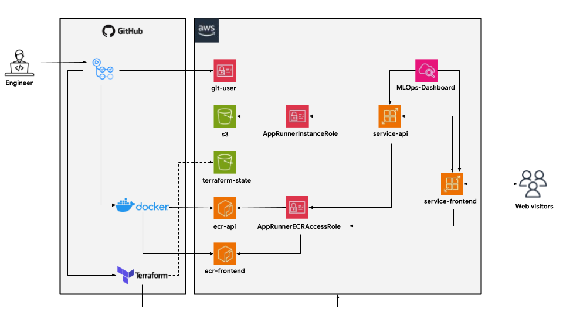

# Sentiment Classification in Amazon customer reviews

The e-commerce sector has witnessed exponential growth in recent years, fundamentally changing consumer habits. In this digital landscape, user-generated content, specifically product reviews, has become a decisive factor in purchasing decisions. However, the sheer volume of these reviews makes manual analysis impossible.

Our project focuses on **Natural Language Processing (NLP)** applied to the Amazon ecosystem. By building a model to classify the sentiment of customer reviews (positive or negative), we aim to transform unstructured text into actionable data. This analysis allows brands not only to adapt their marketing strategies but also to identify product flaws and monitor brand reputation in real-time.

---

## Project Organization

```bash
├── .github/workflows   # CI/CD Pipelines (Infra, Apps, Tests)
├── images/             # Documentation images
├── src/                # Source code
│   ├── api/            # FastAPI application
│   ├── data/           # Data processing scripts
│   ├── frontend/       # Gradio user interface
│   ├── model/          # Model definition and training
│   └── utils/          # Utility functions (S3)
├── terraform/          # Infrastructure as Code
│   ├── infra/          # Stage 1: Base Infra (S3, ECR, IAM)
│   └── app/            # Stage 2: App Runner Services
├── tests/              # Unit and Integration tests
├── Dockerfile.api      # Docker definition for Backend
├── Dockerfile.frontend # Docker definition for Frontend
├── requirements/       # Python dependencies folder
└── README.md
```

---

## Technical Stack

| Area | Technology |
|------|-------------|
| **Languages** | Python 3.12 |
| **Web Frameworks** | FastAPI (Inference API), Gradio (Front-end) |
| **Data processing** | Pandas |
| **Machine Learning** | Scikit-Learn (metrics), TensorFlow |
| **Infrastructure as Code (IaC)** | Terraform |
| **DevOps & CI/CD** | Docker, GitHub Actions, flake8 (Linting), Pytest (Unit testing) |
| **Cloud** | AWS |

---

## Architecture overview


| AWS Service | Resource name                     | Role |
|------------|-----------------------------------|------|
| IAM        | git-user                   | User for CI/CD (GitHub Actions) to deploy infrastructure and push images |
| IAM        | AppRunnerInstanceRole      | Role granting the running application permission to access S3 (to load models) |
| IAM        | AppRunnerECRAccessRole     | Role allowing the App Runner service to pull Docker images from ECR during deployment |
| S3         | terraform-state            | Storage of terraform states for infrastructure and application |
| S3         | s3                         | Storage of ML models, data, and metrics |
| ECR        | ecr-api                    | Storage of Docker images for the FastAPI backend application |
| ECR        | ecr-frontend               | Storage of Docker images for the Gradio frontend application |
| App Runner | service-api                | Deployment and hosting of the inference API (Backend) |
| App Runner | service-frontend           | Deployment and hosting of the User Interface (Frontend) |
| CloudWatch | MLOps-Dashboard            | Observability: Monitoring real-time metrics (CPU, RAM, Latency) of the deployed services to ensure reliability |


---

## Model

The model was trained on a sample of the **amazon_polarity dataset** from Hugging Face. It is a binary text classification model based on a simple **BiLSTM** architecture, composed of an embedding layer followed by two bidirectional LSTM layers and fully connected layers with dropout for regularization.

Texts are tokenized using a Keras Tokenizer (vocabulary size limited to 10,000 words) and padded to a fixed length of 128 tokens. The model is trained with the Adam optimizer and binary cross-entropy loss, using accuracy, precision, and recall as metrics, and early stopping on validation loss.

After training, both the model and the tokenizer are saved and uploaded to an Amazon S3 bucket for later use.

---

## CI/CD Pipelines

This project uses **GitHub Actions** for full automation:

1.  **CI Pipeline (`continuous_integration.yml`):**
    * Triggered on push to `main`.
    * Runs `flake8` for linting to ensure code quality.
    * Runs `pytest` to validate data processing and API logic.

2.  **Infrastructure Pipeline (`infrastructure.yaml`):**
    * Triggered manually via `workflow_dispatch`.
    * Uses Terraform to provision the base AWS infrastructure (S3 Bucket, ECR Repositories, IAM Roles).
    * Includes a "Plan Only" mode for safety before applying changes.

3.  **Training Pipeline (`training.yaml`):**
    * Triggered manually via `workflow_dispatch`.
    * Downloads the latest dataset from S3.
    * Retrains the TensorFlow model and evaluates performance metrics.
    * Uploads the new model artifacts (`.keras` model, tokenizer, metrics) to S3 (acting as a Model Registry).

4.  **Deployment Pipeline (`continuous_delivery.yaml`):**
    * Triggered manually via `workflow_dispatch`.
    * Builds Docker images for the API and Frontend.
    * Pushes images to Amazon ECR.
    * Uses Terraform to deploy/update AWS App Runner services with the new Docker images.

---

## Gradio UI Overview


---

## **The Team** 
* **Georges HOUMBADJI** (georges.houmbadji@edu.ece.fr)
* **Ahmed HADI GONI BOULAMA** (ahmed.hadigoniboulama@edu.ece.fr)
* **Arthur DELFOSSE** (arthur.delfosse@edu.ece.fr)